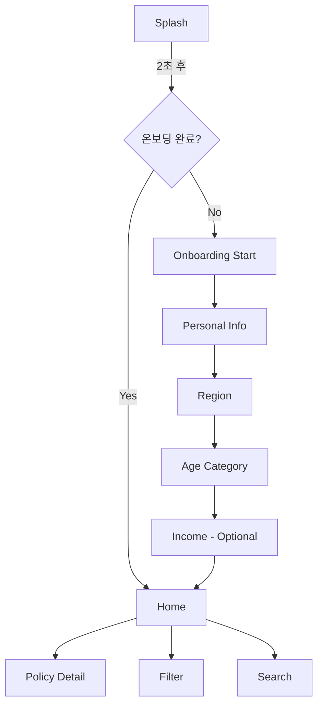

# 📊 Pickly Mobile 라우팅 구조 분석 리포트

**분석 일자**: 2025-10-11
**프로젝트**: Pickly Mobile (Flutter)
**작성자**: System Architecture Designer

---

## 1. 현재 상태 분석

### 1.1 정의된 라우트 (router.dart)

| 라우트 경로 | 화면 이름 | 컴포넌트 | 상태 |
|------------|----------|---------|------|
| `/splash` | splash | SplashScreen | ✅ 구현됨 |
| `/onboarding/age-category` | age-category | AgeCategoryScreen | ✅ 구현됨 |

**총 라우트 수**: 2개

### 1.2 발견된 화면 파일

```
lib/features/onboarding/screens/
├── splash_screen.dart                    ✅ 존재
├── age_category_screen.dart             ✅ 존재
└── age_category_screen_example.dart     (예제 파일)
```

### 1.3 화면 설정 파일 (.claude/screens/)

| 설정 파일 | 화면 ID | 화면 이름 | 네비게이션 경로 | 구현 상태 |
|----------|---------|----------|----------------|---------|
| 001-personal-info.json | 001 | personal-info | `/onboarding/002-region` | ❌ 미구현 |
| 003-age-category.json | 003 | age-category | `/onboarding/004-income` | ✅ 구현됨 |

---

## 2. PRD 요구사항 vs 실제 구현

### 2.1 PRD 정의 온보딩 플로우 (섹션 4)

```
스플래시 (자동)
  ↓ (2초)
온보딩 시작 (환영 화면)
  ↓
가구 정보 입력
  ↓
지역 선택
  ↓
연령/세대 선택
  ↓
필터 홈 (메인 화면)
```

### 2.2 JSON 설정 기반 플로우

```
001-personal-info (기본 정보)
  ↓
002-region (지역 선택) - 설정 파일 없음
  ↓
003-age-category (연령/세대)
  ↓
004-income (소득 구간) - 설정 파일 없음
  ↓
메인 앱
```

### 2.3 누락된 화면

| 화면 ID | 화면 이름 | 설정 파일 | 화면 파일 | 우선순위 |
|--------|----------|----------|----------|---------|
| 000 | onboarding-start | ❌ 없음 | ❌ 없음 | HIGH |
| 001 | personal-info | ✅ 있음 | ❌ 없음 | HIGH |
| 002 | region | ❌ 없음 | ❌ 없음 | HIGH |
| 004 | income | ❌ 없음 | ❌ 없음 | MEDIUM |
| - | filter/home | ❌ 없음 | ❌ 없음 | HIGH |

---

## 3. 최적 라우팅 구조 설계

### 3.1 라우트 계층 구조

```dart
/
├─ /splash                          // 스플래시 (2초 자동 이동)
│
├─ /onboarding                      // 온보딩 플로우
│   ├─ /start                       // 000: 온보딩 시작 (환영)
│   ├─ /personal-info               // 001: 개인정보 입력
│   ├─ /region                      // 002: 지역 선택
│   ├─ /age-category                // 003: 연령/세대 선택 ✅
│   └─ /income                      // 004: 소득 구간 (Phase 1)
│
├─ /home                            // 메인 홈 (정책 피드)
│   └─ /filter                      // 필터 화면
│
├─ /policy                          // 정책 관련
│   ├─ /:id                         // 정책 상세
│   └─ /search                      // 정책 검색
│
└─ /error                           // 에러 페이지
```

### 3.2 라우트 정의 (우선순위별)

#### Phase 1 - MVP (즉시 구현)

| 우선순위 | 라우트 경로 | 화면 이름 | 설명 |
|---------|------------|----------|------|
| 1 | `/splash` | SplashScreen | ✅ 완료 |
| 2 | `/onboarding/start` | OnboardingStartScreen | 환영 화면 |
| 3 | `/onboarding/personal-info` | PersonalInfoScreen | 이름, 나이, 성별 |
| 4 | `/onboarding/region` | RegionScreen | 지역 선택 |
| 5 | `/onboarding/age-category` | AgeCategoryScreen | ✅ 완료 |
| 6 | `/home` | HomeScreen | 정책 피드 |
| 7 | `/policy/:id` | PolicyDetailScreen | 정책 상세 |

#### Phase 2 - 확장 기능

| 우선순위 | 라우트 경로 | 화면 이름 | 설명 |
|---------|------------|----------|------|
| 8 | `/onboarding/income` | IncomeScreen | 소득 구간 |
| 9 | `/home/filter` | FilterScreen | 필터 화면 |
| 10 | `/policy/search` | SearchScreen | 정책 검색 |

### 3.3 네비게이션 플로우



---

## 4. 라우터 구현 설계

### 4.1 GoRouter 구조

```dart
final GoRouter appRouter = GoRouter(
  initialLocation: '/splash',

  // 리다이렉트 로직
  redirect: (context, state) {
    final isOnboardingComplete = // SharedPreferences 체크
    final currentPath = state.uri.path;

    // 온보딩 미완료 시 온보딩으로 리다이렉트
    if (!isOnboardingComplete && !currentPath.startsWith('/onboarding')) {
      return '/onboarding/start';
    }

    return null; // 리다이렉트 없음
  },

  routes: [
    // Splash
    GoRoute(
      path: '/splash',
      name: 'splash',
      builder: (context, state) => const SplashScreen(),
    ),

    // Onboarding Flow
    GoRoute(
      path: '/onboarding',
      routes: [
        GoRoute(
          path: 'start',
          name: 'onboarding-start',
          builder: (context, state) => const OnboardingStartScreen(),
        ),
        GoRoute(
          path: 'personal-info',
          name: 'personal-info',
          builder: (context, state) => const PersonalInfoScreen(),
        ),
        GoRoute(
          path: 'region',
          name: 'region',
          builder: (context, state) => const RegionScreen(),
        ),
        GoRoute(
          path: 'age-category',
          name: 'age-category',
          builder: (context, state) => const AgeCategoryScreen(),
        ),
        GoRoute(
          path: 'income',
          name: 'income',
          builder: (context, state) => const IncomeScreen(),
        ),
      ],
    ),

    // Main App
    GoRoute(
      path: '/home',
      name: 'home',
      builder: (context, state) => const HomeScreen(),
      routes: [
        GoRoute(
          path: 'filter',
          name: 'filter',
          builder: (context, state) => const FilterScreen(),
        ),
      ],
    ),

    // Policy
    GoRoute(
      path: '/policy/:id',
      name: 'policy-detail',
      builder: (context, state) {
        final id = state.pathParameters['id']!;
        return PolicyDetailScreen(policyId: id);
      },
    ),
  ],

  // Error Handling
  errorBuilder: (context, state) => ErrorScreen(
    error: state.error,
    onRetry: () => context.go('/home'),
  ),
);
```

### 4.2 타입 안전 네비게이션 헬퍼

```dart
// lib/core/navigation/routes.dart
abstract class Routes {
  // Splash
  static const splash = '/splash';

  // Onboarding
  static const onboardingStart = '/onboarding/start';
  static const personalInfo = '/onboarding/personal-info';
  static const region = '/onboarding/region';
  static const ageCategory = '/onboarding/age-category';
  static const income = '/onboarding/income';

  // Main
  static const home = '/home';
  static const filter = '/home/filter';

  // Policy
  static String policyDetail(String id) => '/policy/$id';
}

// 사용 예시
context.go(Routes.personalInfo);
context.push(Routes.policyDetail('123'));
```

---

## 5. 화면 구현 상태 매트릭스

| 라우트 | 화면 파일 | 설정 JSON | Provider | Repository | 구현율 | 비고 |
|--------|----------|----------|----------|-----------|-------|------|
| `/splash` | ✅ splash_screen.dart | ❌ | ❌ | ❌ | 100% | 완료 |
| `/onboarding/start` | ❌ | ❌ | ❌ | ❌ | 0% | 신규 |
| `/onboarding/personal-info` | ❌ | ✅ 001 | ❌ | ❌ | 20% | 설정만 |
| `/onboarding/region` | ❌ | ❌ | ❌ | ❌ | 0% | 신규 |
| `/onboarding/age-category` | ✅ | ✅ 003 | ✅ | ✅ | 100% | 완료 |
| `/onboarding/income` | ❌ | ❌ | ❌ | ❌ | 0% | 미정 |
| `/home` | ❌ | ❌ | ❌ | ❌ | 0% | 신규 |
| `/policy/:id` | ❌ | ❌ | ❌ | ❌ | 0% | 미정 |

**전체 구현율**: 25% (2/8 화면)

---

## 6. 문제점 및 개선사항

### 6.1 발견된 문제점

1. **불완전한 온보딩 플로우**
   - 현재 2개 화면만 구현 (splash, age-category)
   - 중간 단계 (start, personal-info, region) 누락
   - 네비게이션 연결 불가능

2. **설정 파일 불일치**
   - 001 설정: next → `/onboarding/002-region` (숫자 기반 경로)
   - 003 설정: previous → `/onboarding/002-region` (미구현)
   - 경로 네이밍 불일치 (kebab-case vs 숫자)

3. **메인 앱 진입점 없음**
   - 온보딩 완료 후 이동할 `/home` 미구현
   - 정책 피드 화면 없음

4. **라우팅 가드 없음**
   - 온보딩 완료 상태 체크 없음
   - 직접 URL 접근 방어 없음

### 6.2 권장 개선사항

#### 우선순위 1 (즉시)
1. **온보딩 플로우 완성**
   - OnboardingStartScreen 생성
   - PersonalInfoScreen 생성 (001 설정 활용)
   - RegionScreen 생성 (002 설정 생성)
   - 네비게이션 연결

2. **라우터 업데이트**
   - 누락된 라우트 추가
   - 경로 네이밍 통일 (kebab-case)
   - 타입 안전 네비게이션 헬퍼 추가

3. **온보딩 상태 관리**
   - SharedPreferences로 완료 상태 저장
   - 리다이렉트 로직 구현

#### 우선순위 2 (1주 내)
4. **메인 앱 화면 구현**
   - HomeScreen (정책 피드)
   - PolicyDetailScreen

5. **에러 핸들링 개선**
   - 전용 ErrorScreen 위젯 분리
   - 네비게이션 히스토리 관리

#### 우선순위 3 (2주 내)
6. **추가 기능**
   - FilterScreen
   - SearchScreen
   - IncomeScreen

---

## 7. 구현 계획

### Phase 1: 라우팅 기반 구축 (1일)

**작업 항목:**
1. router.dart 전면 개선
   - 모든 온보딩 라우트 추가
   - 리다이렉트 로직 구현
   - 에러 처리 개선

2. 네비게이션 헬퍼 생성
   - `lib/core/navigation/routes.dart`
   - 타입 안전 상수 정의

3. 온보딩 상태 서비스
   - `lib/core/services/onboarding_service.dart`
   - SharedPreferences 통합

**예상 소요 시간**: 4시간

### Phase 2: 누락 화면 구현 (3일)

**작업 항목:**
1. OnboardingStartScreen
   - 환영 메시지
   - "시작하기" 버튼
   - 브랜드 일러스트레이션

2. PersonalInfoScreen (001 설정 기반)
   - 이름, 나이, 성별 입력 폼
   - 유효성 검사
   - user_profiles 테이블 저장

3. RegionScreen
   - 시/도 선택
   - 시/군/구 선택 (2단계)
   - 또는 현재 위치 기반 자동 선택

**예상 소요 시간**: 12시간

### Phase 3: 메인 앱 구현 (5일)

**작업 항목:**
1. HomeScreen
   - 정책 리스트
   - 카테고리 필터
   - 개인화 추천

2. PolicyDetailScreen
   - 정책 상세 정보
   - 신청 링크
   - 북마크 기능

**예상 소요 시간**: 20시간

---

## 8. 네비게이션 플로우 검증

### 8.1 정상 사용자 플로우

```
1. 앱 최초 실행
   → /splash (2초)
   → /onboarding/start

2. 온보딩 진행
   → /onboarding/personal-info (입력)
   → /onboarding/region (선택)
   → /onboarding/age-category (선택)
   → /home (완료, 상태 저장)

3. 재방문
   → /splash (2초)
   → /home (온보딩 완료 상태)

4. 정책 탐색
   → /home
   → /policy/123 (상세)
   → /home (뒤로가기)
```

### 8.2 엣지 케이스

```
1. 직접 URL 접근 (딥링크)
   - /policy/123 접근
   → 온보딩 미완료 시 /onboarding/start 리다이렉트
   → 완료 시 정상 표시

2. 온보딩 중단 후 재시작
   - /onboarding/region에서 앱 종료
   → 재실행 시 /onboarding/start부터 (진행 상태 미저장)

3. 네트워크 에러
   - 데이터 로딩 실패
   → 에러 화면 표시
   → 재시도 버튼으로 /home 복귀
```

---

## 9. 기술적 결정 (ADR)

### ADR-001: GoRouter 사용

**결정**: Flutter의 공식 라우팅 패키지인 GoRouter 사용

**이유**:
- 선언적 라우팅 (Declarative routing)
- 딥링크 지원
- URL 기반 네비게이션
- 타입 안전 경로 파라미터
- 커뮤니티 표준

**대안**:
- Navigator 1.0 (구식, 복잡)
- Auto Route (코드 생성 오버헤드)
- Beamer (학습 곡선)

### ADR-002: Kebab-case 경로 네이밍

**결정**: 모든 라우트 경로는 kebab-case 사용 (예: `/onboarding/personal-info`)

**이유**:
- URL 표준 규칙
- 가독성
- 일관성
- 검색 엔진 친화적

**대안**:
- camelCase (URL 비표준)
- snake_case (가독성 낮음)
- 숫자 기반 (의미 불명확)

### ADR-003: 온보딩 상태 관리

**결정**: SharedPreferences로 온보딩 완료 플래그 저장

**이유**:
- 간단한 boolean 값 저장
- 네이티브 플랫폼 지원
- 앱 재실행 시 유지
- 추가 의존성 불필요

**대안**:
- Hive (오버킬)
- Supabase (네트워크 필요)
- 메모리 (재실행 시 손실)

---

## 10. 다음 단계

### 즉시 실행 (오늘)
1. ✅ 라우팅 구조 분석 완료
2. router.dart 업데이트
   - 모든 온보딩 라우트 추가
   - Routes 헬퍼 클래스 생성
   - 리다이렉트 로직 추가

### 이번 주
3. 누락 화면 구현
   - OnboardingStartScreen
   - PersonalInfoScreen
   - RegionScreen

4. 온보딩 플로우 통합 테스트

### 다음 주
5. HomeScreen 구현
6. PolicyDetailScreen 구현
7. 전체 네비게이션 E2E 테스트

---

## 11. 참고 자료

- **PRD**: `/docs/PRD.md` - 섹션 4 (핵심 기능)
- **현재 라우터**: `/apps/pickly_mobile/lib/core/router.dart`
- **화면 설정**: `/.claude/screens/`
- **GoRouter 문서**: https://pub.dev/packages/go_router

---

**작성자**: System Architecture Designer
**검토 필요**: 개발팀 리더, 프로덕트 매니저
**다음 리뷰**: 라우터 구현 완료 후
