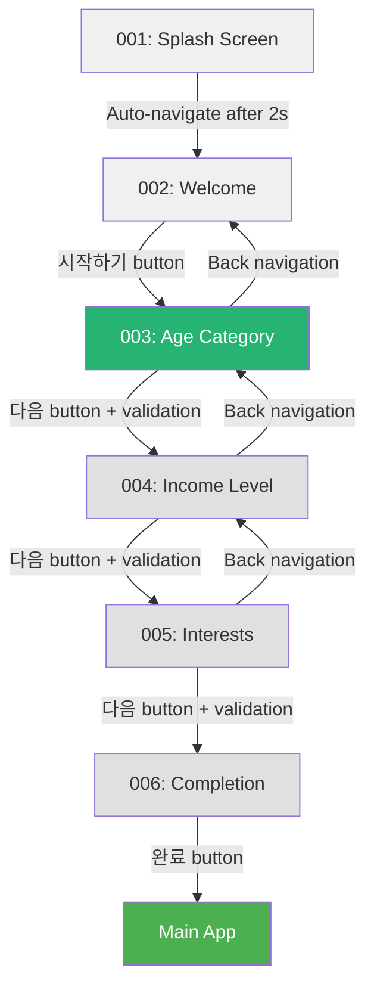
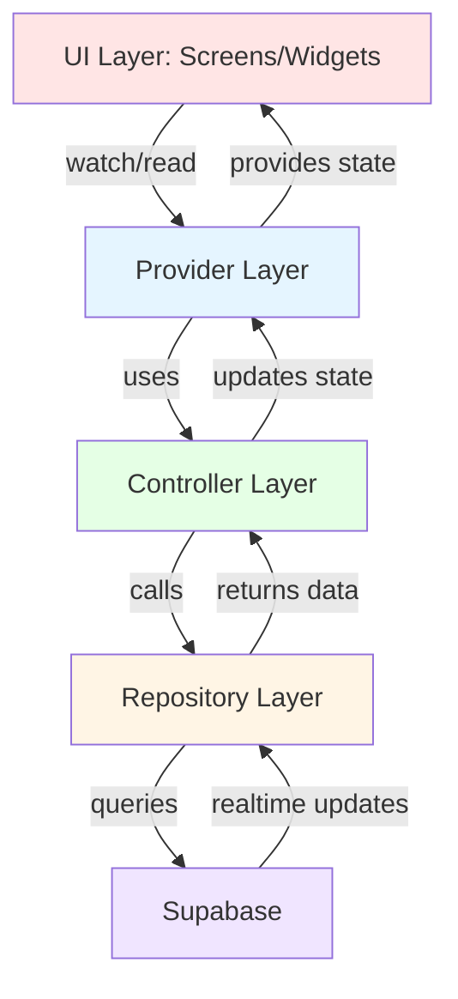
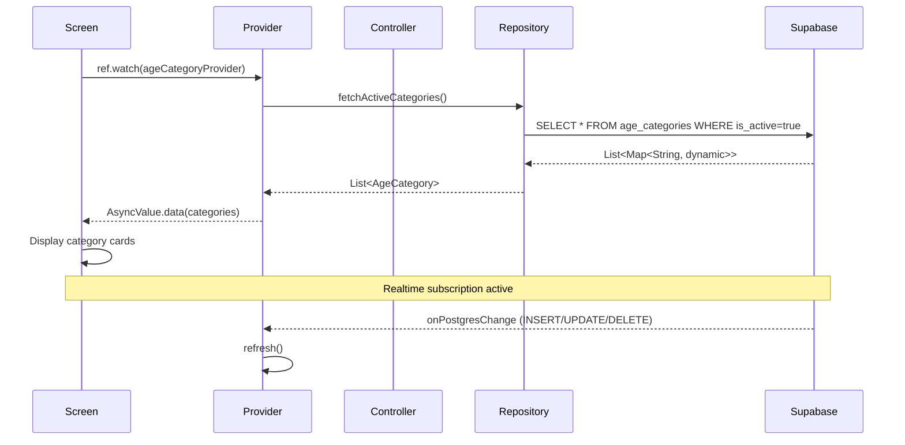
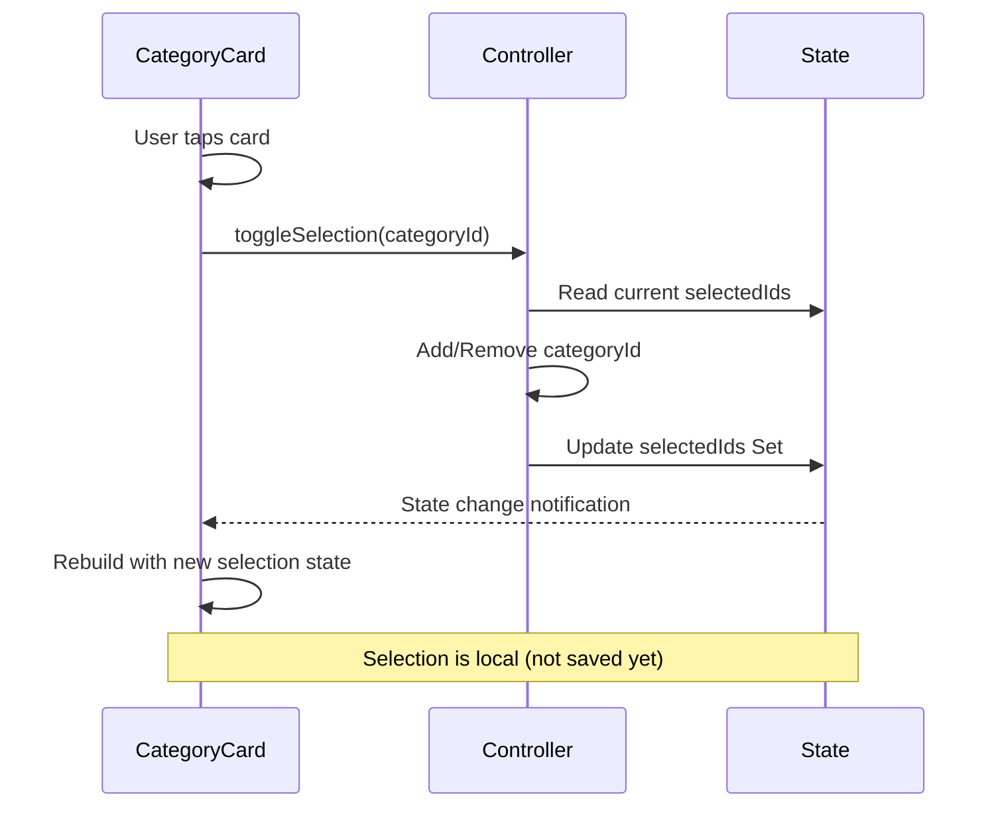
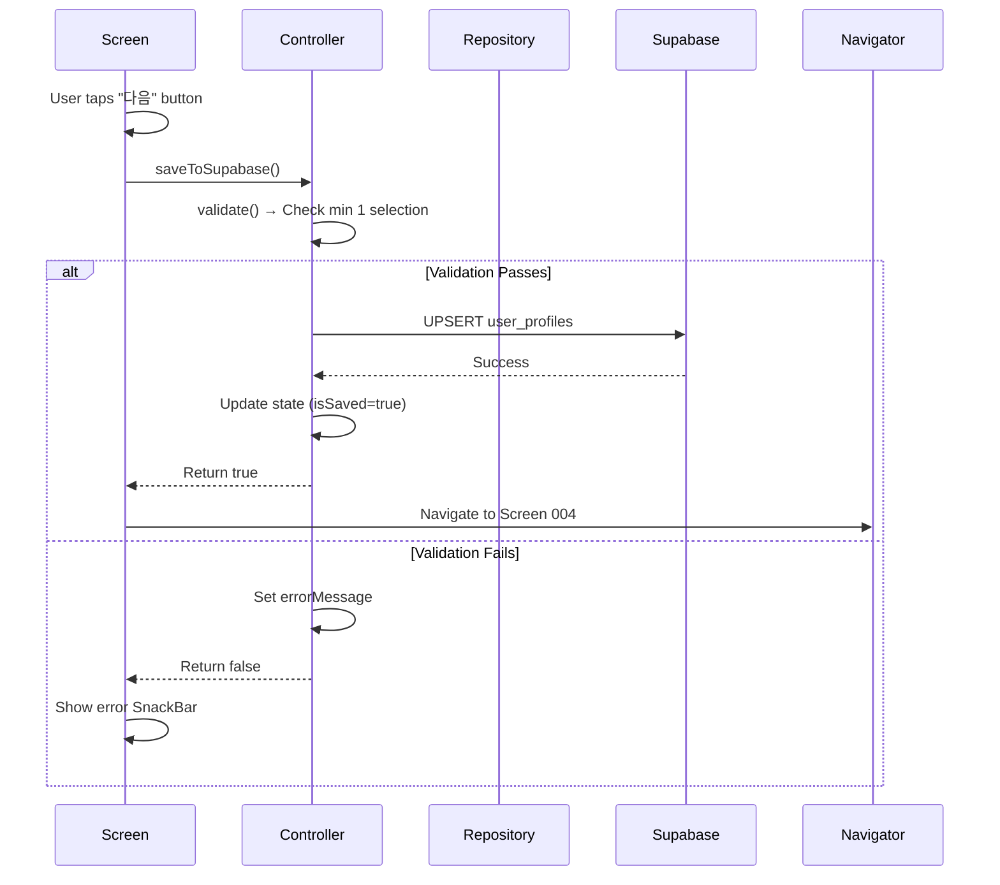
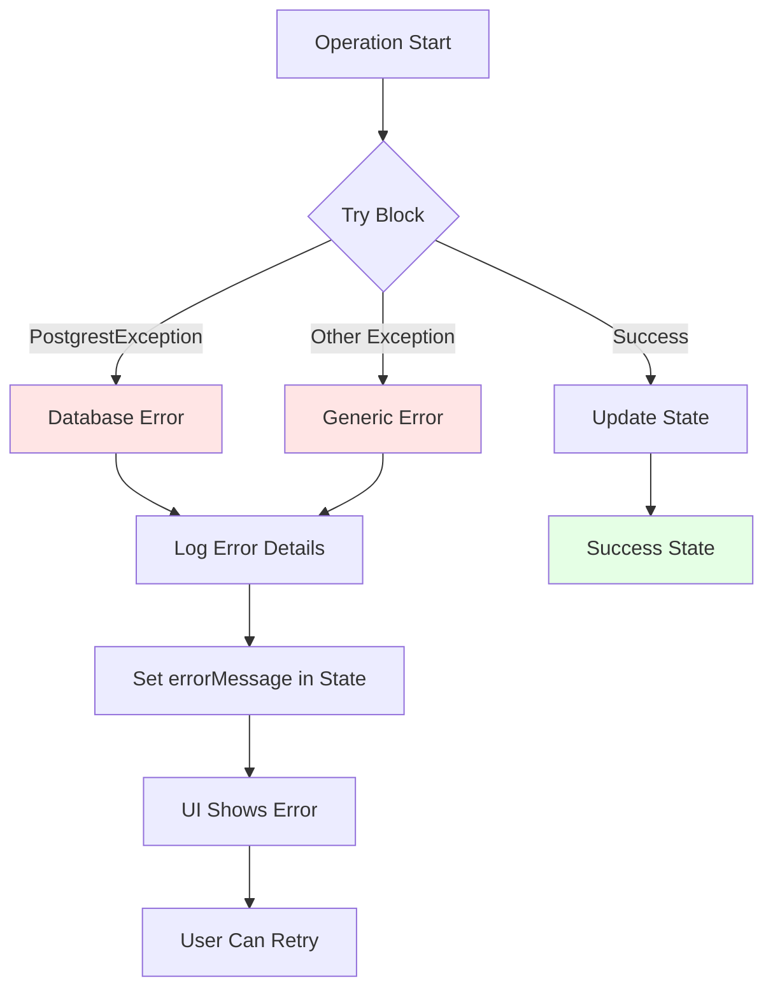
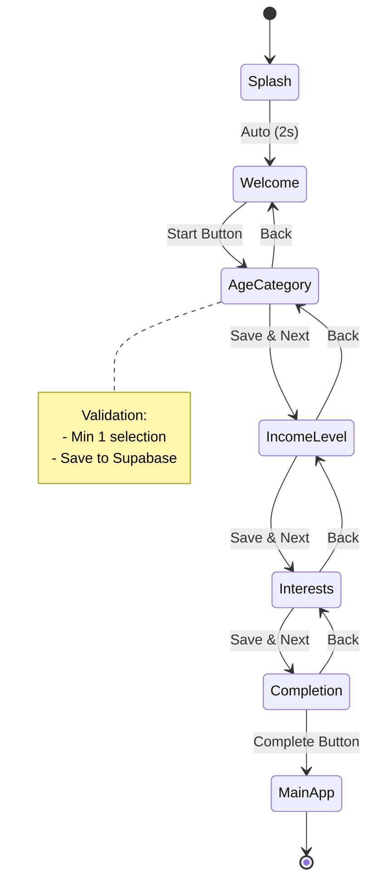

# Onboarding Flow Documentation

## Overview

The Pickly onboarding flow is a multi-step process that collects user preferences and demographics to personalize policy recommendations. This document describes the complete flow, state management, data persistence, and navigation logic.

**Current Implementation Status:** Screen 003 (Age Category Selection) ✅

---

## Flow Architecture



---

## Screen Sequence

### 001: Splash Screen
- **Purpose:** Branding, initial loading
- **Duration:** 2 seconds (auto-navigate)
- **Progress:** 1/5 (20%)
- **State:** No user input
- **Navigation:** Auto → 002

### 002: Welcome Screen (Not Implemented)
- **Purpose:** Introduction, value proposition
- **Progress:** 1/5 (20%)
- **User Action:** "시작하기" button
- **Navigation:** Manual → 003

### 003: Age Category Selection ✅
- **Purpose:** Collect age/generation demographics
- **Progress:** 2/5 (40%)
- **File:** `apps/pickly_mobile/lib/features/onboarding/screens/age_category_screen_example.dart`
- **Validation:** Minimum 1 selection required
- **State:** Multi-select (Set\<String\>)
- **Persistence:** Saves to `user_profiles.selected_categories`
- **Navigation:** Manual → 004
- **Back:** Manual → 002

### 004: Income Level Selection (Not Implemented)
- **Purpose:** Collect income bracket for policy targeting
- **Progress:** 3/5 (60%)
- **Validation:** Single selection required
- **State:** Single-select (String)
- **Navigation:** Manual → 005
- **Back:** Manual → 003

### 005: Interest Categories (Not Implemented)
- **Purpose:** Collect policy interest areas
- **Progress:** 4/5 (80%)
- **Validation:** Minimum 1 selection
- **State:** Multi-select (Set\<String\>)
- **Navigation:** Manual → 006
- **Back:** Manual → 004

### 006: Completion (Not Implemented)
- **Purpose:** Summary, final confirmation
- **Progress:** 5/5 (100%)
- **User Action:** "완료" button
- **Navigation:** Manual → Main App
- **Back:** Manual → 005

---

## State Management Flow

### Architecture Pattern

**Riverpod State Management** with Repository Pattern



### Layer Responsibilities

| Layer | Responsibility | Example |
|-------|---------------|---------|
| **UI** | Display data, handle user input | `AgeCategoryScreenExample` |
| **Provider** | Expose state to UI, manage lifecycle | `ageCategoryProvider` |
| **Controller** | Business logic, validation, state updates | `AgeCategoryController` |
| **Repository** | Data access, error handling | `AgeCategoryRepository` |
| **Database** | Data persistence, realtime updates | Supabase PostgreSQL |

---

## Data Flow: Age Category Selection

### 1. Initial Load



### 2. User Selection



### 3. Save & Navigation



---

## Data Persistence

### Database Schema

#### Table: `user_profiles`

```sql
CREATE TABLE user_profiles (
  user_id UUID PRIMARY KEY REFERENCES auth.users(id),
  selected_categories TEXT[] NOT NULL DEFAULT '{}',
  selected_income_level TEXT,
  selected_interests TEXT[],
  onboarding_completed BOOLEAN DEFAULT FALSE,
  created_at TIMESTAMP DEFAULT NOW(),
  updated_at TIMESTAMP DEFAULT NOW()
);
```

#### Table: `age_categories`

```sql
CREATE TABLE age_categories (
  id UUID PRIMARY KEY DEFAULT gen_random_uuid(),
  title TEXT NOT NULL,
  description TEXT NOT NULL,
  icon_component TEXT NOT NULL,
  icon_url TEXT,
  min_age INTEGER,
  max_age INTEGER,
  sort_order INTEGER NOT NULL DEFAULT 0,
  is_active BOOLEAN NOT NULL DEFAULT TRUE,
  created_at TIMESTAMP DEFAULT NOW(),
  updated_at TIMESTAMP DEFAULT NOW()
);

CREATE INDEX idx_age_categories_active ON age_categories(is_active);
CREATE INDEX idx_age_categories_sort ON age_categories(sort_order);
```

### Save Operation

```dart
// Controller: saveToSupabase()
await supabase.client.from('user_profiles').upsert({
  'user_id': userId,
  'selected_categories': selectedIds.toList(),  // Set → List
  'updated_at': DateTime.now().toIso8601String(),
}, onConflict: 'user_id');
```

**SQL Generated:**
```sql
INSERT INTO user_profiles (user_id, selected_categories, updated_at)
VALUES ($1, $2, $3)
ON CONFLICT (user_id) DO UPDATE
SET selected_categories = $2, updated_at = $3;
```

### Load Operation

```dart
// Controller: _loadSavedSelections()
final response = await supabase.client
    .from('user_profiles')
    .select('selected_categories')
    .eq('user_id', userId)
    .maybeSingle();

if (response != null) {
  final selectedCategories = response['selected_categories'] as List?;
  if (selectedCategories != null) {
    final selectedIds = selectedCategories.cast<String>().toSet();
    // Update state with loaded selections
  }
}
```

---

## Navigation Flow

### Implementation

```dart
// In AgeCategoryScreenExample
Future<void> _handleSave(BuildContext context, WidgetRef ref) async {
  final controller = ref.read(ageCategoryControllerProvider.notifier);
  final success = await controller.saveToSupabase();

  if (!context.mounted) return;

  if (success) {
    // Show success message
    ScaffoldMessenger.of(context).showSnackBar(
      const SnackBar(content: Text('저장되었습니다')),
    );

    // Navigate to next screen (Screen 004 - Income Level)
    Navigator.push(
      context,
      MaterialPageRoute(builder: (_) => IncomeLevelScreen()),
    );
  } else {
    // Error is already displayed in UI via errorMessage
    ScaffoldMessenger.of(context).showSnackBar(
      const SnackBar(content: Text('저장에 실패했습니다')),
    );
  }
}
```

### Navigation Guard

```dart
// Future implementation: Prevent back navigation after save
class OnboardingRoute extends MaterialPageRoute {
  OnboardingRoute({required WidgetBuilder builder})
      : super(builder: builder);

  @override
  bool canTransitionTo(TransitionRoute nextRoute) {
    // Allow forward navigation only if current screen is saved
    return super.canTransitionTo(nextRoute);
  }
}
```

---

## Validation Rules

### Age Category (Screen 003)

| Rule | Validation | Error Message |
|------|------------|---------------|
| Minimum Selection | `selectedIds.length >= 1` | "최소 1개 이상의 연령/세대를 선택해주세요" |
| Authentication | `currentUserId != null` | "로그인이 필요합니다" |
| Network | `try-catch` Supabase call | "저장에 실패했습니다. 다시 시도해주세요." |

### Income Level (Screen 004) - Not Implemented

| Rule | Validation | Error Message |
|------|------------|---------------|
| Required Selection | `selectedIncome != null` | "소득 수준을 선택해주세요" |

### Interests (Screen 005) - Not Implemented

| Rule | Validation | Error Message |
|------|------------|---------------|
| Minimum Selection | `selectedInterests.length >= 1` | "최소 1개 이상의 관심 분야를 선택해주세요" |

---

## Error Handling

### Error Flow



### Error Display

```dart
// In UI
if (selectionState.errorMessage != null)
  Container(
    // Red background, error icon, dismissible
    child: Row(
      children: [
        Icon(Icons.error_outline, color: Colors.red[700]),
        Text(selectionState.errorMessage!),
        IconButton(
          icon: Icon(Icons.close),
          onPressed: () {
            ref.read(ageCategoryControllerProvider.notifier).clearError();
          },
        ),
      ],
    ),
  ),
```

---

## Realtime Updates

### Subscription Setup

```dart
// In AgeCategoryNotifier.build()
void _setupRealtimeSubscription() {
  _channel = supabase.client
      .channel('age_categories_changes')
      .onPostgresChanges(
        event: PostgresChangeEvent.all,  // INSERT, UPDATE, DELETE
        schema: 'public',
        table: 'age_categories',
        callback: (payload) {
          refresh();  // Reload data from database
        },
      )
      .subscribe();
}
```

### Cleanup

```dart
// Automatic cleanup on provider disposal
ref.onDispose(() {
  _channel?.unsubscribe();
});
```

### Use Cases

1. **Admin adds new category** → All users see it instantly
2. **Admin updates category description** → UI updates without refresh
3. **Admin deactivates category** → Removed from user's screen

---

## Progress Tracking

### Progress Bar

```dart
OnboardingHeader(
  currentStep: getCurrentStep(),
  totalSteps: 5,
)
```

| Screen | Step | Progress |
|--------|------|----------|
| 001: Splash | 1 | 20% |
| 002: Welcome | 1 | 20% |
| 003: Age Category | 2 | 40% |
| 004: Income Level | 3 | 60% |
| 005: Interests | 4 | 80% |
| 006: Completion | 5 | 100% |

### Completion Tracking

```sql
-- Mark onboarding as complete
UPDATE user_profiles
SET onboarding_completed = TRUE
WHERE user_id = $1;
```

---

## Code Organization

```
apps/pickly_mobile/lib/
├── core/
│   ├── models/
│   │   └── age_category.dart              # Data model
│   └── services/
│       └── supabase_service.dart          # Supabase client
│
├── features/onboarding/
│   ├── providers/
│   │   ├── age_category_provider.dart     # Data provider
│   │   └── age_category_controller.dart   # Selection controller
│   │
│   ├── screens/
│   │   └── age_category_screen_example.dart  # Screen implementation
│   │
│   └── widgets/
│       └── onboarding_header.dart         # Progress header
│
└── repositories/
    └── age_category_repository.dart       # Data access layer
```

---

## Testing Strategy

### Unit Tests

```dart
// Test model serialization
test('AgeCategory.fromJson creates valid instance', () { ... });

// Test repository methods
test('fetchActiveCategories returns sorted list', () { ... });

// Test controller validation
test('validate returns false with no selections', () { ... });
```

### Widget Tests

```dart
// Test screen rendering
testWidgets('Screen displays categories', (tester) async { ... });

// Test user interaction
testWidgets('Tapping card toggles selection', (tester) async { ... });

// Test error display
testWidgets('Error message shows when validation fails', (tester) async { ... });
```

### Integration Tests

```dart
// Test complete flow
testWidgets('User can complete onboarding flow', (tester) async {
  // 1. Start at splash screen
  // 2. Navigate through each screen
  // 3. Make selections
  // 4. Verify data saved to database
  // 5. Reach main app
});
```

---

## Performance Considerations

### Optimization Strategies

1. **Data Caching**
   - Categories cached in provider state
   - No refetch on widget rebuild

2. **Lazy Loading**
   - Screens not in view are not built
   - Use `AutomaticKeepAliveClientMixin` if needed

3. **Debouncing**
   - Realtime updates debounced (300ms)
   - Prevents excessive rebuilds

4. **Pagination**
   - Not needed (small dataset: ~6 categories)
   - Future: Add if category count grows

5. **Image Optimization**
   - SVG icons (vector, scalable)
   - Cached by Flutter automatically

---

## Security Considerations

### Row-Level Security (RLS)

```sql
-- Users can only read their own profile
CREATE POLICY "Users can read own profile"
ON user_profiles FOR SELECT
USING (auth.uid() = user_id);

-- Users can update their own profile
CREATE POLICY "Users can update own profile"
ON user_profiles FOR UPDATE
USING (auth.uid() = user_id);

-- Anyone can read active categories
CREATE POLICY "Anyone can read active categories"
ON age_categories FOR SELECT
USING (is_active = true);
```

### Input Validation

```dart
// Controller validates before save
if (!state.isValid) {
  state = state.copyWith(errorMessage: 'Validation failed');
  return false;
}

// Repository validates category IDs exist
Future<bool> validateCategoryIds(List<String> ids) async {
  // Ensure all IDs are valid UUIDs and exist in database
}
```

---

## Future Enhancements

### 1. Skip Logic

Allow users to skip optional steps:

```dart
if (isOptionalScreen && user.wantsToSkip) {
  Navigator.pushReplacement(context, nextScreen);
}
```

### 2. Progress Persistence

Save progress to allow users to resume:

```sql
ALTER TABLE user_profiles
ADD COLUMN onboarding_step INTEGER DEFAULT 1;
```

### 3. A/B Testing

Test different onboarding flows:

```dart
final flowVariant = getOnboardingVariant(userId);
if (flowVariant == 'A') {
  return OnboardingFlowA();
} else {
  return OnboardingFlowB();
}
```

### 4. Analytics

Track user behavior:

```dart
analytics.logEvent(
  name: 'onboarding_step_completed',
  parameters: {
    'step': currentStep,
    'duration_seconds': elapsed.inSeconds,
    'selections_count': selectedIds.length,
  },
);
```

### 5. Gamification

Add rewards for completing onboarding:

```dart
if (onboardingComplete) {
  await awardBadge('onboarding_complete');
  await grantWelcomeBonus();
}
```

---

## Troubleshooting

### Issue: Realtime Updates Not Working

**Solution:**
1. Check Supabase realtime is enabled for table
2. Verify channel subscription is active
3. Check network connectivity
4. Review Supabase logs for errors

### Issue: Data Not Persisting

**Solution:**
1. Verify user is authenticated (`currentUserId != null`)
2. Check database permissions (RLS policies)
3. Review error logs for PostgreSQL errors
4. Confirm `upsert` operation succeeded

### Issue: Navigation Stuck

**Solution:**
1. Check validation passes before navigation
2. Verify `context.mounted` before navigation
3. Review navigation stack (use `Navigator.pushReplacement` if needed)

---

## Related Documentation

- [Age Category API](../api/age-category-api.md)
- [Age Selection Card Component](../components/age-selection-card.md)
- [Onboarding Header Component](../components/onboarding-header.md)
- [Architecture Diagram](../architecture/age-category-screen-architecture.md)

---

## Diagrams

### Complete Onboarding State Machine



---

**Last Updated:** 2025-01-10

**Contributors:** Documentation Agent (Claude Flow Swarm)

**Version:** 1.0.0
