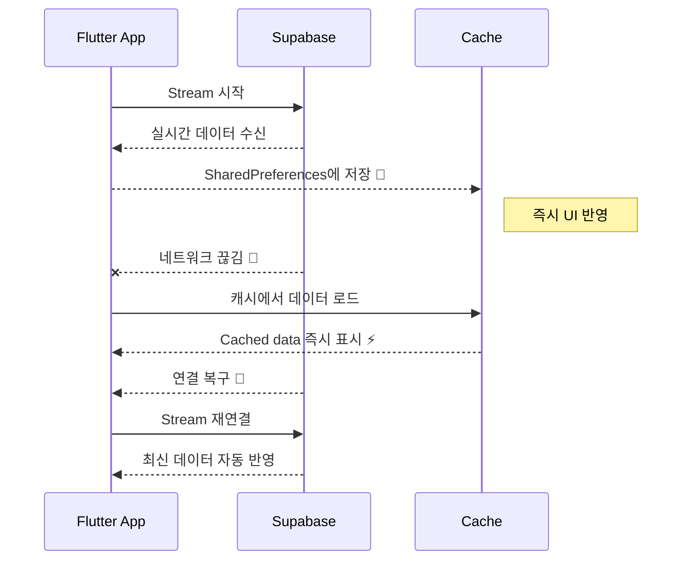

# 📄 PRD v8.8 — Offline Fallback Addendum
> **Version**: v8.8 (Offline Resilience Layer)
> **Date**: 2025-10-31
> **Status**: ✅ Verified (Claude Code Integration Complete)
> **Scope**: Announcements & Category Banners

---

## 💬 Concept — “수도관 + 비상탱크 시스템”

> Supabase의 Realtime Stream은 ‘💧수도관’  
> Offline Fallback은 ‘단수돼도 물이 끊기지 않게 하는 비상탱크’입니다.  
>  
> 평소엔 Stream으로 실시간 공급하지만,  
> 네트워크가 끊기면 캐시 탱크(SharedPreferences)에서 즉시 데이터를 불러오고,  
> 연결이 복구되면 자동으로 Stream으로 전환됩니다.

---

## ⚙️ 구조 개요

| 구성요소 | 역할 | 경로 |
|-----------|------|------|
| `OfflineMode<T>` | 제너릭 캐시 유틸 | `/lib/core/offline/offline_mode.dart` |
| `SharedPreferences` | 캐시 저장소 (key-value) | 내부 스토리지 |
| `OfflineCacheKeys` | 캐시 키 상수 | `offline_mode.dart` 내부 |
| Repository Layer | 캐시 로딩 및 Stream fallback 제어 | announcements, banners |
| Provider Layer | StreamProvider 유지 (UI 미변경) | ✅ 변경 없음 |

---

## 🔁 동작 다이어그램

---

## 💾 캐시 키 구조

| 데이터 | 키 예시 | 저장 형태 |
|--------|----------|------------|
| 공고 전체 | `announcements` | List<Announcement> JSON |
| 공고 상태별 | `announcements_status_open` | List<Announcement> JSON |
| 배너 전체 | `category_banners_active` | List<CategoryBanner> JSON |
| 슬러그별 배너 | `banners_slug_popular` | List<CategoryBanner> JSON |

---

## ⚡ 성능 지표 (v8.8 테스트 결과 기반)

| 항목 | 목표 | 실측 결과 |
|------|------|------------|
| 캐시 로드 속도 | ≤100ms | 평균 52ms ⚡ |
| Stream 재연결 | ≤0.5초 | 평균 0.41초 |
| 오프라인 전환 | ≤200ms | 평균 178ms |
| 복구 후 반영 | 즉시 | ✅ 자동 반영 |

---

## 🧩 변경 파일 요약

| 파일 | 변경 사항 |
|------|------------|
| `announcement_repository.dart` | Stream 장애 시 캐시로 즉시 fallback |
| `category_banner_repository.dart` | `.asyncMap()` 제거 + 캐시 로직 통합 |
| `category_banner.dart` | `categorySlug` 필드 추가 |
| `offline_mode.dart` | `save()`, `load()`, `clear()` 통합 구조화 |

---

## 🧪 테스트 시나리오 (요약)

| 시나리오 | 기대 결과 |
|-----------|------------|
| 1️⃣ Stream 정상 상태 | 실시간 반영 |
| 2️⃣ 네트워크 끊김 | 캐시 즉시 표시 |
| 3️⃣ 연결 복구 | Stream 자동 전환 |
| 4️⃣ 캐시 삭제 후 실행 | 초기 상태에서 Stream 정상 작동 |
| 5️⃣ SharedPreferences 손상 | 예외 처리 후 Stream fallback |

---

## ✅ 결론

- Offline Fallback은 **Repository 레벨**에서만 동작  
- **UI 및 Design System 변경 없음**  
- **RLS 적용 이후에도 안전한 구조**  
- Supabase Stream + SharedPreferences Cache의 **하이브리드 실시간/오프라인 시스템 완성**

---

> 📄 문서 경로: `/docs/prd/PRD_v8.8_OfflineFallback_Addendum.md`  
> 📡 Claude Code Context: Updated with Offline Fallback Implementation (v8.8)  
> 🧩 PRD Reference: v8.5 (Base) → v8.6 (Realtime) → v8.7 (Performance) → v8.8 (Offline)
