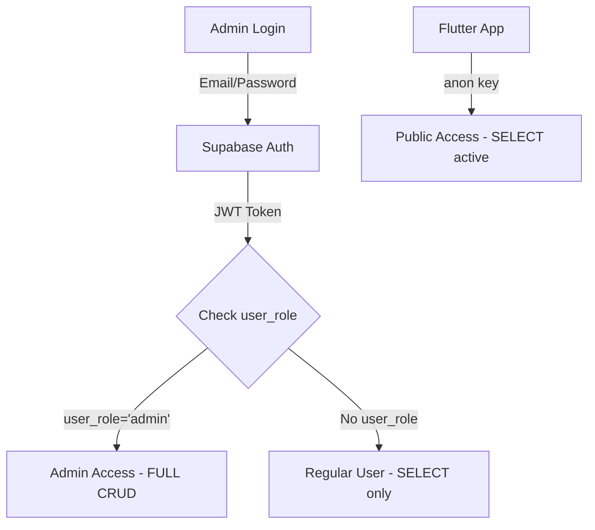

# 📘 Pickly Integrated System — PRD v9.6.2 (Admin Role-Based RLS & Storage Policy)

**Last Updated:** 2025-11-06
**Status:** ✅ Production Ready
**Scope:** Complete RLS Policy Overhaul + Storage Upload Security

---

## 🎯 Executive Summary

PRD v9.6.2 addresses critical security and usability issues discovered in v9.6.1:

### Problems Identified:
1. ❌ **RLS Policy Confusion**: Mix of `public` and `authenticated` policies causing access issues
2. ❌ **Admin Upload Failures**: File uploads failing due to RLS/Storage policy conflicts
3. ❌ **No Role-Based Access**: All authenticated users treated equally (no admin distinction)
4. ❌ **Incomplete Storage Policies**: Missing proper bucket policies for file uploads

### Solutions Implemented:
1. ✅ **Role-Based RLS**: `user_role='admin'` metadata check in policies
2. ✅ **Unified Policy Structure**: Clear separation of service_role, admin, and public access
3. ✅ **Storage Security**: Proper bucket policies with admin upload permissions
4. ✅ **Improved Upload Handler**: Better error handling and service_role usage

---

## 🔐 Security Model (Updated)

### Access Levels

| Role | Description | RLS Policy | Use Case |
|------|-------------|------------|----------|
| `service_role` | Backend services | FULL access (bypasses RLS) | API endpoints, automated tasks |
| `authenticated` + `user_role='admin'` | Admin users | FULL CRUD on all tables | Admin panel operations |
| `authenticated` (no admin role) | Logged-in users | SELECT active data only | Future user features |
| `anon` (public) | Anonymous users | SELECT active data only | Flutter app, public API |

### Authentication Flow



---

## 📊 Database Schema (No Changes)

All table schemas from PRD v9.6.1 remain unchanged. Only RLS policies are updated.

### Affected Tables:
- `benefit_categories`
- `benefit_subcategories`
- `age_categories`
- `announcements`
- `home_management_*` (banners, popular items, etc.)
- `api_sources` / `api_collection_logs`
- `raw_announcements`

---

## 🛡️ RLS Policy Structure (v9.6.2)

### Template for All Admin-Managed Tables

```sql
-- 1. Service Role: Bypass RLS (for backend APIs)
-- No policy needed - service_role bypasses RLS by default

-- 2. Admin Users: Full CRUD
CREATE POLICY "admin_select" ON table_name
  FOR SELECT TO authenticated
  USING (auth.jwt() ->> 'user_role' = 'admin');

CREATE POLICY "admin_insert" ON table_name
  FOR INSERT TO authenticated
  WITH CHECK (auth.jwt() ->> 'user_role' = 'admin');

CREATE POLICY "admin_update" ON table_name
  FOR UPDATE TO authenticated
  USING (auth.jwt() ->> 'user_role' = 'admin')
  WITH CHECK (auth.jwt() ->> 'user_role' = 'admin');

CREATE POLICY "admin_delete" ON table_name
  FOR DELETE TO authenticated
  USING (auth.jwt() ->> 'user_role' = 'admin');

-- 3. Public/Regular Users: Active data only
CREATE POLICY "public_select_active" ON table_name
  FOR SELECT TO anon, authenticated
  USING (is_active = true);
```

### Key Changes from v9.6.1:

| Aspect | v9.6.1 (OLD) | v9.6.2 (NEW) |
|--------|-------------|-------------|
| Admin Check | No role check | `auth.jwt() ->> 'user_role' = 'admin'` |
| Policy Count | 2-3 per table | 5 per table (4 admin + 1 public) |
| Service Role | Separate policies | Bypasses RLS (no policy) |
| Public Access | `TO public` | `TO anon, authenticated` |

---

## 📦 Storage Buckets & Policies

### Bucket: `benefit-icons`

**Purpose**: Store SVG icons for benefit categories, subcategories, age categories

**RLS Policies**:

```sql
-- Admin can upload (authenticated + user_role='admin')
CREATE POLICY "admin_upload_benefit_icons"
ON storage.objects FOR INSERT TO authenticated
WITH CHECK (
  bucket_id = 'benefit-icons' AND
  auth.jwt() ->> 'user_role' = 'admin'
);

-- Admin can update existing files
CREATE POLICY "admin_update_benefit_icons"
ON storage.objects FOR UPDATE TO authenticated
USING (bucket_id = 'benefit-icons' AND auth.jwt() ->> 'user_role' = 'admin')
WITH CHECK (bucket_id = 'benefit-icons' AND auth.jwt() ->> 'user_role' = 'admin');

-- Admin can delete files
CREATE POLICY "admin_delete_benefit_icons"
ON storage.objects FOR DELETE TO authenticated
USING (bucket_id = 'benefit-icons' AND auth.jwt() ->> 'user_role' = 'admin');

-- Public can view all files (for Flutter app)
CREATE POLICY "public_view_benefit_icons"
ON storage.objects FOR SELECT
USING (bucket_id = 'benefit-icons');
```

### Bucket: `home-banners`

**Purpose**: Store banner images for home management

**Policies**: Same structure as `benefit-icons`

---

## 🔧 Implementation Plan

### Phase 5.3.1 — Database Migration

**File**: `migrations/20251106000001_fix_rls_admin_role_guard_prd_v9_6_2.sql`

**Steps**:
1. Drop all existing RLS policies on affected tables
2. Create new role-based policies using template above
3. Verify policies with test queries
4. Add helper function for admin check (if needed)

### Phase 5.3.2 — Admin Metadata Setup

**Supabase Studio Steps**:
1. Navigate to: Authentication → Users
2. Find admin user (e.g., `admin@pickly.com` or `dev@pickly.com`)
3. Click "Edit User" → "App Metadata" tab
4. Add:
```json
{
  "user_role": "admin"
}
```
5. Save changes

**Verification**:
```sql
SELECT email, raw_app_meta_data->>'user_role' as role
FROM auth.users
WHERE email LIKE '%@pickly.com';
```

### Phase 5.3.3 — Storage Policy Update

**File**: `migrations/20251106000002_fix_storage_bucket_policies_prd_v9_6_2.sql`

**Steps**:
1. Drop existing storage.objects policies
2. Create new admin-role-based policies
3. Ensure buckets are public for SELECT operations
4. Verify with test upload

### Phase 5.3.4 — Admin Upload Handler Fix

**File**: `apps/pickly_admin/src/pages/api/upload.ts`

**Required Changes**:
```typescript
import { createClient } from '@supabase/supabase-js'
import { NextApiRequest, NextApiResponse } from 'next'

// Use service_role key for server-side uploads
const supabase = createClient(
  process.env.NEXT_PUBLIC_SUPABASE_URL!,
  process.env.SUPABASE_SERVICE_ROLE_KEY!
)

export default async function handler(req: NextApiRequest, res: NextApiResponse) {
  if (req.method !== 'POST') {
    return res.status(405).json({ error: 'Method not allowed' })
  }

  try {
    const { file, bucket } = req.body

    if (!file || !bucket) {
      return res.status(400).json({ error: 'Missing file or bucket parameter' })
    }

    // Upload file using service_role (bypasses RLS)
    const { data, error } = await supabase.storage
      .from(bucket)
      .upload(`${Date.now()}_${file.name}`, file, {
        cacheControl: '3600',
        upsert: false
      })

    if (error) {
      console.error('[Upload Error]', error)
      return res.status(400).json({ error: error.message })
    }

    // Get public URL
    const { data: { publicUrl } } = supabase.storage
      .from(bucket)
      .getPublicUrl(data.path)

    return res.status(200).json({ url: publicUrl })
  } catch (error) {
    console.error('[Unexpected Error]', error)
    return res.status(500).json({ error: 'Internal server error' })
  }
}
```

---

## ✅ Verification Checklist

### Database Policies:
- [ ] All tables have 5 RLS policies (4 admin + 1 public)
- [ ] `auth.jwt() ->> 'user_role' = 'admin'` check exists in admin policies
- [ ] Public policies use `TO anon, authenticated`
- [ ] Service role bypasses RLS (no policies for service_role)

### Storage Buckets:
- [ ] `benefit-icons` bucket exists and is public
- [ ] `home-banners` bucket exists and is public
- [ ] storage.objects has admin upload/update/delete policies
- [ ] storage.objects has public SELECT policy

### Admin Metadata:
- [ ] Admin users have `user_role='admin'` in app_metadata
- [ ] Regular users have no user_role (or user_role != 'admin')

### Upload Functionality:
- [ ] Admin can upload icon files via UI
- [ ] Uploaded files appear in Supabase Storage
- [ ] Public URL is accessible from Flutter app
- [ ] Error messages are clear and helpful

---

## 🔄 Migration from v9.6.1 to v9.6.2

### Backward Compatibility:

✅ **Preserved**:
- All table schemas unchanged
- Flutter app continues to work (uses anon key)
- Public API access unchanged
- Database seed data unchanged

⚠️ **Breaking Changes**:
- **Admin login required**: Admins MUST have `user_role='admin'` metadata
- **Old RLS policies replaced**: Previous policies will be dropped
- **Service role required**: Backend APIs must use service_role key

### Migration Steps:

1. **Backup Database**: `supabase db dump > backup_v9.6.1.sql`
2. **Apply Migrations**: Run 20251106000001 and 20251106000002
3. **Update Admin Metadata**: Add user_role to admin accounts
4. **Test Upload**: Verify file upload works in Admin UI
5. **Test Flutter App**: Ensure data loads correctly
6. **Monitor Logs**: Check for RLS policy violations

---

## 📋 Appendix A: Sample Queries

### Check Admin Policies:
```sql
SELECT tablename, policyname, cmd, roles, qual, with_check
FROM pg_policies
WHERE tablename IN ('benefit_categories', 'age_categories')
ORDER BY tablename, cmd;
```

### Check Storage Policies:
```sql
SELECT policyname, definition
FROM pg_policies
WHERE schemaname = 'storage' AND tablename = 'objects'
ORDER BY policyname;
```

### Verify Admin Role:
```sql
SELECT email,
       raw_app_meta_data->>'user_role' as role,
       created_at
FROM auth.users
WHERE raw_app_meta_data->>'user_role' = 'admin';
```

---

## 🚀 Success Criteria

Phase 5.3 is considered complete when:

1. ✅ All database tables have correct RLS policies
2. ✅ Storage buckets have admin upload permissions
3. ✅ Admin users have `user_role='admin'` metadata
4. ✅ File upload works in Admin UI without errors
5. ✅ Flutter app loads data correctly (no regressions)
6. ✅ No RLS policy violation errors in logs

---

**End of PRD v9.6.2**
