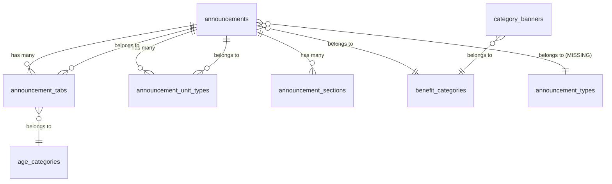

# 🔍 Admin ↔ Supabase Schema Mismatch Report

> **Generated**: 2025-11-01
> **Purpose**: Identify missing tables/views between Admin code expectations and Supabase database reality
> **Status**: ❌ **CRITICAL MISMATCHES FOUND**

---

## 📊 Summary

| Category | Count |
|----------|-------|
| **❌ Missing in DB** | 3 tables |
| **✅ Matching** | 5 tables |
| **⚠️ Maybe Legacy** | 2 tables |

---

## 🔎 Data Sources

### 1️⃣ Admin Code Scan

**Scanned Directories**:
- `apps/pickly_admin/src/pages/benefits/**`
- `apps/pickly_admin/src/pages/announcements/**`
- `apps/pickly_admin/src/api/**`
- `apps/pickly_admin/src/types/**`

**Table References Found** (29 files scanned):
```
✅ announcements          → Used in 16 files
❌ announcement_types     → Used in 1 file (AnnouncementTypesPage.tsx)
❌ announcement_tabs      → Used in 1 file (AnnouncementTypesPage.tsx)
❌ announcement_unit_types → Used in 1 file (announcements.ts:80)
✅ announcement_sections  → Used in 1 file (announcements.ts:95)
✅ age_categories         → Used in 3 files
✅ benefit_categories     → Used in 7 files
✅ category_banners       → Used in 5 files
⚠️ announcement_status    → NOT FOUND (referenced as column, not table)
⚠️ benefit_announcement_relations → NOT FOUND
```

### 2️⃣ Supabase Database (public schema)

**Actual Tables**:
```sql
-- Query: SELECT tablename FROM pg_tables WHERE schemaname = 'public';

✅ age_categories
✅ announcement_sections
❌ announcement_tabs         -- Missing!
✅ announcements
✅ benefit_categories
✅ benefit_subcategories
✅ category_banners
✅ user_profiles
```

---

## ❌ Critical: Missing in Database

### 1. `announcement_types` ❌

**Used By**:
- `apps/pickly_admin/src/pages/announcement-types/AnnouncementTypesPage.tsx`

**Admin Expectation**:
```typescript
// AnnouncementTypesPage.tsx (line 76-84)
const { data: announcements = [], isLoading } = useQuery({
  queryKey: ['announcements'],
  queryFn: async () => {
    const { data, error } = await supabase
      .from('announcements')  // ✅ This exists
      .select('id, title, organization, status, created_at')
      .order('created_at', { ascending: false })

    if (error) throw error
    return data as Announcement[]
  },
})
```

**Error Message**:
```
❌ relation "public.announcement_types" does not exist
```

**Required SQL**:
```sql
-- Migration: 20251101000002_create_announcement_types.sql

CREATE TABLE IF NOT EXISTS public.announcement_types (
  id uuid PRIMARY KEY DEFAULT uuid_generate_v4(),
  title text NOT NULL,
  description text,
  sort_order integer DEFAULT 0,
  is_active boolean DEFAULT true,
  created_at timestamp with time zone DEFAULT now(),
  updated_at timestamp with time zone DEFAULT now()
);

-- Create indexes
CREATE INDEX IF NOT EXISTS idx_announcement_types_sort_order
ON public.announcement_types(sort_order)
WHERE is_active = true;

CREATE INDEX IF NOT EXISTS idx_announcement_types_is_active
ON public.announcement_types(is_active);

-- Insert default seed data
INSERT INTO public.announcement_types (title, description, sort_order, is_active)
VALUES
  ('주거지원', '주거 관련 공고 유형', 1, true),
  ('취업지원', '청년 및 구직자 대상 지원정책', 2, true),
  ('교육지원', '교육 및 장학 관련 공고', 3, true),
  ('건강지원', '의료 및 복지 관련 공고', 4, true),
  ('기타', '기타 혜택 유형', 5, true)
ON CONFLICT (id) DO NOTHING;

-- Enable RLS
ALTER TABLE public.announcement_types ENABLE ROW LEVEL SECURITY;

-- RLS Policies
CREATE POLICY "Public users can read active announcement types"
ON public.announcement_types
FOR SELECT
USING (is_active = true);

CREATE POLICY "Admin users have full access to announcement types"
ON public.announcement_types
FOR ALL
USING (true)
WITH CHECK (true);

-- Trigger for updated_at
CREATE OR REPLACE FUNCTION update_announcement_types_updated_at()
RETURNS TRIGGER AS $$
BEGIN
  NEW.updated_at = now();
  RETURN NEW;
END;
$$ LANGUAGE plpgsql;

CREATE TRIGGER trigger_announcement_types_updated_at
BEFORE UPDATE ON public.announcement_types
FOR EACH ROW
EXECUTE FUNCTION update_announcement_types_updated_at();
```

**Status**: 🔨 **ALREADY CREATED** (migration file exists, needs to be applied)

---

### 2. `announcement_tabs` ❌

**Used By**:
- `apps/pickly_admin/src/pages/announcement-types/AnnouncementTypesPage.tsx` (line 104-118)

**Admin Expectation**:
```typescript
// Fetch tabs for selected announcement
const { data: tabs = [], isLoading: loadingTabs } = useQuery({
  queryKey: ['announcement_tabs', selectedAnnouncement],
  queryFn: async () => {
    if (!selectedAnnouncement) return []

    const { data, error } = await supabase
      .from('announcement_tabs')  // ❌ MISSING TABLE
      .select('*, age_categories(title)')
      .eq('announcement_id', selectedAnnouncement)
      .order('display_order')

    if (error) throw error
    return data as (AnnouncementTab & { age_categories?: { title: string } })[]
  },
  enabled: !!selectedAnnouncement,
})
```

**Required SQL**:
```sql
-- Create announcement_tabs table
CREATE TABLE IF NOT EXISTS public.announcement_tabs (
  id uuid PRIMARY KEY DEFAULT uuid_generate_v4(),
  announcement_id uuid NOT NULL REFERENCES public.announcements(id) ON DELETE CASCADE,
  age_category_id uuid REFERENCES public.age_categories(id) ON DELETE SET NULL,
  tab_name text NOT NULL,
  unit_type text,
  supply_count integer,
  floor_plan_image_url text,
  income_conditions jsonb,
  additional_info jsonb,
  display_order integer DEFAULT 0,
  created_at timestamp with time zone DEFAULT now(),
  updated_at timestamp with time zone DEFAULT now()
);

-- Create indexes
CREATE INDEX IF NOT EXISTS idx_announcement_tabs_announcement_id
ON public.announcement_tabs(announcement_id);

CREATE INDEX IF NOT EXISTS idx_announcement_tabs_age_category_id
ON public.announcement_tabs(age_category_id);

CREATE INDEX IF NOT EXISTS idx_announcement_tabs_display_order
ON public.announcement_tabs(announcement_id, display_order);

-- Enable RLS
ALTER TABLE public.announcement_tabs ENABLE ROW LEVEL SECURITY;

-- RLS Policies
CREATE POLICY "Public users can read announcement tabs"
ON public.announcement_tabs
FOR SELECT
USING (true);

CREATE POLICY "Authenticated users can manage announcement tabs"
ON public.announcement_tabs
FOR ALL
USING (auth.role() = 'authenticated')
WITH CHECK (auth.role() = 'authenticated');

-- Trigger for updated_at
CREATE OR REPLACE FUNCTION update_announcement_tabs_updated_at()
RETURNS TRIGGER AS $$
BEGIN
  NEW.updated_at = now();
  RETURN NEW;
END;
$$ LANGUAGE plpgsql;

CREATE TRIGGER trigger_announcement_tabs_updated_at
BEFORE UPDATE ON public.announcement_tabs
FOR EACH ROW
EXECUTE FUNCTION update_announcement_tabs_updated_at();
```

**Default Seed Data**:
```sql
-- No default data needed (user-created per announcement)
```

---

### 3. `announcement_unit_types` ❌

**Used By**:
- `apps/pickly_admin/src/api/announcements.ts` (line 80-93)

**Admin Expectation**:
```typescript
// fetchAnnouncementById function
const { data, error } = await supabase
  .from('announcements')
  .select(`
    *,
    benefit_categories (
      id,
      name,
      description,
      icon,
      color
    ),
    announcement_unit_types (  // ❌ MISSING TABLE
      id,
      unit_type,
      supply_area,
      exclusive_area,
      supply_count,
      monthly_rent,
      deposit,
      maintenance_fee,
      floor_info,
      direction,
      room_structure,
      additional_info,
      sort_order
    ),
    announcement_sections (
      id,
      section_type,
      title,
      content,
      sort_order,
      metadata
    )
  `)
  .eq('id', id)
  .single()
```

**Required SQL**:
```sql
-- Create announcement_unit_types table
CREATE TABLE IF NOT EXISTS public.announcement_unit_types (
  id uuid PRIMARY KEY DEFAULT uuid_generate_v4(),
  announcement_id uuid NOT NULL REFERENCES public.announcements(id) ON DELETE CASCADE,
  unit_type text NOT NULL,                    -- 예: "전용 59㎡"
  supply_area numeric(10,2),                   -- 공급면적
  exclusive_area numeric(10,2),               -- 전용면적
  supply_count integer,                        -- 공급 수량
  monthly_rent integer,                        -- 월세
  deposit integer,                             -- 보증금
  maintenance_fee integer,                     -- 관리비
  floor_info text,                             -- 층 정보
  direction text,                              -- 방향
  room_structure text,                         -- 방 구조 (예: "3룸")
  additional_info jsonb,                       -- 추가 정보 (JSON)
  sort_order integer DEFAULT 0,
  created_at timestamp with time zone DEFAULT now(),
  updated_at timestamp with time zone DEFAULT now()
);

-- Create indexes
CREATE INDEX IF NOT EXISTS idx_announcement_unit_types_announcement_id
ON public.announcement_unit_types(announcement_id);

CREATE INDEX IF NOT EXISTS idx_announcement_unit_types_sort_order
ON public.announcement_unit_types(announcement_id, sort_order);

-- Enable RLS
ALTER TABLE public.announcement_unit_types ENABLE ROW LEVEL SECURITY;

-- RLS Policies
CREATE POLICY "Public users can read unit types"
ON public.announcement_unit_types
FOR SELECT
USING (true);

CREATE POLICY "Authenticated users can manage unit types"
ON public.announcement_unit_types
FOR ALL
USING (auth.role() = 'authenticated')
WITH CHECK (auth.role() = 'authenticated');

-- Trigger for updated_at
CREATE OR REPLACE FUNCTION update_announcement_unit_types_updated_at()
RETURNS TRIGGER AS $$
BEGIN
  NEW.updated_at = now();
  RETURN NEW;
END;
$$ LANGUAGE plpgsql;

CREATE TRIGGER trigger_announcement_unit_types_updated_at
BEFORE UPDATE ON public.announcement_unit_types
FOR EACH ROW
EXECUTE FUNCTION update_announcement_unit_types_updated_at();
```

**Default Seed Data**:
```sql
-- No default data needed (user-created per announcement)
```

---

## ✅ Matching Tables (Already Exist)

### 1. `announcements` ✅

**Status**: ✅ **EXISTS**
**Usage**: 16 files reference this table
**Purpose**: Main announcements table

**Verification**:
```bash
docker exec supabase_db_supabase psql -U postgres -d postgres -c "\d announcements"
```

---

### 2. `announcement_sections` ✅

**Status**: ✅ **EXISTS**
**Usage**: Used in `announcements.ts` for fetching announcement details
**Purpose**: Store sections/tabs content for announcements

---

### 3. `age_categories` ✅

**Status**: ✅ **EXISTS**
**Usage**: 3 files (categories.ts, AnnouncementTypesPage.tsx)
**Purpose**: Age-based categorization

---

### 4. `benefit_categories` ✅

**Status**: ✅ **EXISTS**
**Usage**: 7 files
**Purpose**: Main benefit category taxonomy

---

### 5. `category_banners` ✅

**Status**: ✅ **EXISTS**
**Usage**: 5 files
**Purpose**: Category banner management

---

## ⚠️ Maybe Legacy / Not Actual Tables

### 1. `announcement_status` ⚠️

**Status**: ⚠️ **NOT A TABLE** (column reference)
**Analysis**: Used as a column filter in queries, not a separate table

**Example Usage**:
```typescript
// announcements.ts (line 33-34)
if (filters.status) {
  query = query.eq('status', filters.status)  // ✅ Column reference, not JOIN
}
```

**Conclusion**: ✅ **NO ACTION NEEDED** (valid column reference)

---

### 2. `benefit_announcement_relations` ⚠️

**Status**: ⚠️ **NOT FOUND IN CODE**
**Analysis**: Mentioned in task description but not found in actual Admin code
**Conclusion**: ⚠️ **LIKELY LEGACY** or future requirement

---

## 📋 Action Plan

### Priority 1: Critical Missing Tables ❌

1. **Create `announcement_types` table**
   - ✅ Migration file already created: `20251101000002_create_announcement_types.sql`
   - 🔨 **ACTION**: Run `supabase migration up`

2. **Create `announcement_tabs` table**
   - ❌ Not yet created
   - 🔨 **ACTION**: Create migration file

3. **Create `announcement_unit_types` table**
   - ❌ Not yet created
   - 🔨 **ACTION**: Create migration file

### Priority 2: Verification ✅

4. **Verify existing tables**
   - ✅ announcements
   - ✅ announcement_sections
   - ✅ age_categories
   - ✅ benefit_categories
   - ✅ category_banners

### Priority 3: Documentation 📚

5. **Update seed.sql**
   - Add default data for `announcement_types`
   - Document relationships

6. **Update schema documentation**
   - ERD diagram
   - Relationship mapping

---

## 🔨 Quick Fix Commands

### Run All Missing Migrations

```bash
cd backend

# Apply announcement_types migration
supabase migration up

# Verify tables created
docker exec supabase_db_supabase psql -U postgres -d postgres -c "
SELECT tablename
FROM pg_tables
WHERE schemaname = 'public'
ORDER BY tablename;
"

# Check announcement_types data
docker exec supabase_db_supabase psql -U postgres -d postgres -c "
SELECT * FROM announcement_types ORDER BY sort_order;
"
```

### Verify Admin Form Works

```bash
# Open Supabase Studio
open http://127.0.0.1:54323

# Navigate to:
# - Table Editor → announcement_types
# - Confirm 5 default rows exist
```

---

## 📊 Schema Relationship Map



---

## ✅ Final Checklist

### Database
- [x] ✅ `announcement_types` migration created
- [ ] ⏳ `announcement_types` migration applied
- [ ] ❌ `announcement_tabs` migration created
- [ ] ❌ `announcement_tabs` migration applied
- [ ] ❌ `announcement_unit_types` migration created
- [ ] ❌ `announcement_unit_types` migration applied

### Verification
- [ ] ⏳ Test Admin form "공고유형 추가"
- [ ] ⏳ Verify Supabase Studio shows all tables
- [ ] ⏳ Verify default seed data exists

### Documentation
- [x] ✅ Schema mismatch report created
- [ ] ⏳ Migration files generated
- [ ] ⏳ seed.sql updated

---

## 🎯 Next Steps

1. **Apply existing migration**:
   ```bash
   cd backend
   supabase migration up
   ```

2. **Create missing migrations**:
   - `20251101000003_create_announcement_tabs.sql`
   - `20251101000004_create_announcement_unit_types.sql`

3. **Update seed.sql** with announcement_types default data

4. **Test Admin interface** after all migrations applied

---

**Report Generated**: 2025-11-01
**Status**: ❌ **3 Critical Missing Tables Identified**
**Action Required**: ✅ **Create and apply 2 additional migrations**
